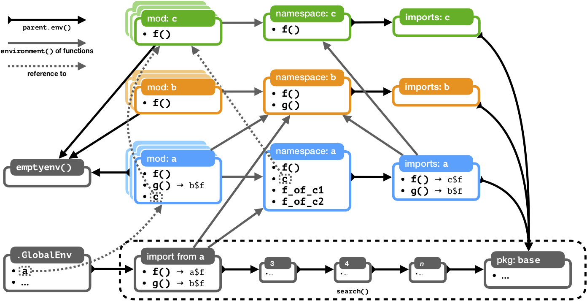

```{r setup, include=FALSE}
knitr::opts_chunk$set(
  echo = TRUE, 
  collapse = TRUE,
  comment = "#> ")
options(width = 60)
library(rmarkdown)
library(knitr)
library(fs)
```

Package is loaded using [`pak`](https://pak.r-lib.org/), which checks for installation, and then loads.

```{r pak-inst, eval=FALSE}
if (!requireNamespace('pak')) {
    install.packages('pak', repos = 'https://r-lib.github.io/p/pak/dev/')
}
```

`pak::pkg_install()` package below:

```{r install, message=FALSE, warning=FALSE}
pak::pkg_install('klmr/box@dev')
```

## Package Structure

The package files/folders differ slightly from other R package. See the `box-main` download from Github:

```{r folder-structure, echo=FALSE}
fs::dir_tree("../pkg/box-main/", recurse = FALSE)
```

### Vignettes

```{r mod-tree, echo=FALSE}
fs::dir_tree('../pkg/box-main/vignettes/', recurse = TRUE) 
```

### Environment schema 

```{r environment-schema, echo=FALSE}

```

